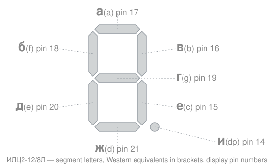

# ИЛЦ2-12/8Л (ILC2-12/8L)

Vacuum fluorescent display used in the *Elektronika* **MK-35** and **MK-66 / MK-66A** microcalculators, driven directly by the К145ИП16Б / К145ИП15А calculator chip.

Twelve-digit single-colour (green) segmented display for digits 0–9 with a decimal point after each position. Multiplexed drive. Flat glass envelope with 22 leads, brought out from the two opposite long sides. Horizontal working position, mass 20 g. Listed Western analogue: **11-ST-24**.

> **Lead numbering:** counted left to right along the bottom row, and right to left along the top row, viewed from the front of the display.

## Main parameters

| Parameter | Value |
|:--|:--|
| Display type / colour | Numeric / green |
| Number of digit positions | 12 |
| Information field, mm | 5 × 45 |
| Digit position, mm | 2.4 × 4.3 |
| Luminous area, one digit / total, mm² | 2.2 / 26.4 |
| Number of controlled elements | 88 |
| Viewing angle, ° | 45 |
| Warm-up time, s | ≤ 0.1 |
| Nominal brightness, cd/m² | 700 |
| Brightness non-uniformity, % | 40 |
| Brightness at end of life, cd/m² | 300 |
| Filament voltage, nominal / range, V | 2.4 / 2.15 … 2.9 |
| Filament current, nominal / range, mA | 22 / 20 … 24 |
| Grid cut-off voltage, V | ≤ −1.5 |
| Grid pulse voltage, V | 24 |
| Anode (segment) pulse voltage, V | 24 |
| Grid pulse current, one position, mA | 2 |
| Segment pulse current, one position, mA | 0.75 |
| Filament switching cycles | ≥ 10⁴ |
| Duty ratio (*скважность*) | 10 ± 1 |
| Ambient temperature, °C | −45 … +70 |
| Minimum service life, h | 1000 |

## Pinout

| Pin | Electrode | | Pin | Electrode |
|--:|:--|---|--:|:--|
| 1 | Grid, position 12 | | 12 | Grid, position 1 |
| 2 | Grid, position 11 | | 13 | Cathode |
| 3 | Grid, position 10 | | 14 | Segment **и**, positions 1–12 |
| 4 | Grid, position 9 | | 15 | Segment **е**, positions 1–12 |
| 5 | Grid, position 8 | | 16 | Segment **в**, positions 1–12 |
| 6 | Grid, position 7 | | 17 | Segment **а**, positions 1–12 |
| 7 | Grid, position 6 | | 18 | Segment **б**, positions 1–12 |
| 8 | Grid, position 5 | | 19 | Segment **г**, positions 1–12 |
| 9 | Grid, position 4 | | 20 | Segment **д**, positions 1–12 |
| 10 | Grid, position 3 | | 21 | Segment **ж**, positions 1–12 |
| 11 | Grid, position 2 | | 22 | Cathode, conductive coating on the inner surface of the envelope |

The filament (cathode) runs between pins 13 and 22, with the internal screen coating tied to the pin-22 end. Grids are numbered in reverse to the pins: position 1 is the rightmost digit on pin 12, position 12 the leftmost on pin 1.

## Segment designations

| Russian | Western | Position | Display pin |
|:-:|:-:|:--|--:|
| а | a | top | 17 |
| б | f | top left | 18 |
| в | b | top right | 16 |
| г | g | middle | 19 |
| д | e | bottom left | 20 |
| е | c | bottom right | 15 |
| ж | d | bottom | 21 |
| и | dp | decimal point | 14 |

> **Note:** this is not the ГОСТ a–g ordering that the letters suggest. The Russian letters run а (top), then б and в for the upper left and upper right, г for the middle bar, д and е for the lower left and lower right, and ж for the bottom. In particular **ж is the bottom segment, not the middle**, and **г is the middle**.
>
> Both schematics agree. The MK-35 sheet's *Расположение анодов HG1* diagram draws the letters in place with their pin numbers; the MK-66 sheet's *Расположение сегментов HG* diagram draws the same arrangement using Western letters — A top, F and B upper left and right, M middle, E and C lower left and right, D bottom.

## How the calculator uses it

The twelve positions carry: mantissa sign, 8 mantissa digits, exponent sign, 2 exponent digits — reading left to right on the glass, which is position 12 down to position 1 in the datasheet's numbering.

| Display position | Pin | Shows |
|--:|--:|:--|
| 12 | 1 | Mantissa sign |
| 11 … 4 | 2 … 9 | Mantissa digits 1 … 8 |
| 3 | 10 | Exponent sign |
| 2 | 11 | Exponent digit 1 |
| 1 | 12 | Exponent digit 2 |

## Predicted wiring to the calculator chip

Derived by combining this datasheet with the net names on the MK-35 schematic. **Not yet verified on hardware** — use as a checklist against a real board. Every line runs through a series resistor (180 k in the MK-35; 180 k and 300 k in the MK-66), so expect that resistance rather than a short.

| Display pin | Signal | Chip pin (per MK-35) | Verified |
|--:|:--|--:|:-:|
| 1 | Grid 12 — mantissa sign | 40 | ☐ |
| 2 | Grid 11 — mantissa 1Р | 39 | ☐ |
| 3 | Grid 10 — mantissa 2Р | 38 | ☐ |
| 4 | Grid 9 — mantissa 3Р | 37 | ☐ |
| 5 | Grid 8 — mantissa 4Р | 36 | ☐ |
| 6 | Grid 7 — mantissa 5Р | 35 | ☐ |
| 7 | Grid 6 — mantissa 6Р | 34 | ☐ |
| 8 | Grid 5 — mantissa 7Р | 33 | ☐ |
| 9 | Grid 4 — mantissa 8Р | 32 | ☐ |
| 10 | Grid 3 — exponent sign | 41 | ☐ |
| 11 | Grid 2 — exponent 1Р | 44 | ☐ |
| 12 | Grid 1 — exponent 2Р | 42 | ☐ |
| 13 | Cathode | — (voltage converter) | ☐ |
| 14 | Segment и | 30 | ☐ |
| 15 | Segment е | 27 | ☐ |
| 16 | Segment в | 29 | ☐ |
| 17 | Segment а | 20 | ☐ |
| 18 | Segment б | 23 | ☐ |
| 19 | Segment г | 28 | ☐ |
| 20 | Segment д | 25 | ☐ |
| 21 | Segment ж | 26 | ☐ |
| 22 | Cathode + screen | — (voltage converter) | ☐ |

**The three exponent grids are the ones to check first.** Chip pins 41, 44 and 42 are named on the MK-35 sheet but never appear on the MK-66 sheet, whose chip-side numbering instead includes 19, 21, 22 and 24 — pins the MK-35 sheet does not name. Either the MK-66 scan is misread, or К145ИП15А brings the exponent strobes out on different pins from К145ИП16Б. Display pins 10, 11 and 12 settle it.

## Notes

- The MK-66 schematic's display connections match this datasheet exactly: two cathode pins, eight segments, twelve grids. It is only the chip side of that drawing that carries no signal names.
- The datasheet's count of **88 controlled elements** does not equal 12 positions × 8 elements = 96. The eight missing element sites are most likely on the two sign positions, which only ever show a minus and a decimal point.
- Everything is negative with respect to the calculator's case, so bench measurements should be referenced to the case rather than to the battery negative.

## Sources

- ИЛЦ2-12/8Л datasheet (Russian), including the electrode/lead table.
- *Схема электрическая принципиальная микрокалькулятора "Электроника МК35"* — HG1 pin table and net names.
- *Схема электрическая принципиальная микрокалькулятора "Электроника МК 66"* — display connections.
